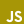

  <h3>— Languages Information —</h3>

<table align="center">
  <tr>
    <td width="100" rowspan="2"><b>Native</b></td>
    <td width="500" colspan="5"><b>Languages</b></td>
    <tr>
    <td width="100" align="center">日本語 </td>
    <td colspan="4"></td>
  </tr>
  </tr>
  <tr>
    <td rowspan="6"><b>Medium</b></td>
    <td colspan="5"><b>Computer Languages</b></td>
  </tr>
  <tr>
    <td width="100" align="center">HTML </td>
    <td width="100" align="center">CSS </td>
    <td colspan="4"></td>
  </tr>
  <tr>
    <td colspan="5"><b>Languages</b></td>
  </tr>
  <tr>
    <td width="100" align="center">None </td>
    <td colspan="4"></td>
  </tr>
  <tr>
    <td colspan="5"><b>Constructed Languages</b></td>
  </tr>
  <tr>
    <td width="100" align="center">None</td>
    <td colspan="4"></td>
  </tr>
  <tr>
    <td rowspan="6"><b>Learning</b></td>
    <td colspan="5"><b>Computer Languages</b></td>
  </tr>
  <tr>
    <td width="100" align="center">JavaScript </td>
    <td colspan="4"></td>
  </tr>
  <tr>
    <td colspan="5"><b>Languages</b></td>
  </tr>
  <tr>
    <td width="100" align="center">English </td>
    <td width="100" align="center">Deutsch </td>
    <td width="100" align="center">lingua Latina </td>
    <td width="100" align="center">Esperanto </td>
    <td colspan="1"></td>
  </tr>
  <tr>
    <td colspan="5"><b>Constructed Languages</b></td>
  </tr>
  <tr>
    <td width="100" align="center">None</td>
    <td colspan="4"></td>
  </tr>
  <tr>
    <td rowspan="6"><b>Dabble</b></td>
    <td colspan="5"><b>Computer Languages</b></td>
  </tr>
  <tr>
    <td width="100" align="center">SCSS </td>
    <td colspan="4"></td>
  </tr>
  <tr>
    <td colspan="5"><b>Languages</b></td>
  </tr>
  <tr>
    <td width="100" align="center">한국어 </td>
    <td width="100" align="center">suomi </td>
    <td colspan="4"></td>
  </tr>
  <tr>
    <td colspan="5"><b>Constructed Languages</b></td>
  </tr>
  <tr>
    <td width="100" align="center">qilxaléh </td>
    <td colspan="4"></td>
  </tr>
  <tr>
    <td rowspan="6"><b>Interested</b></td>
    <td colspan="5"><b>Computer Languages</b></td>
  </tr>
  <tr>
    <td width="100" align="center">C# </td>
    <td width="100" align="center">Java </td>
    <td colspan="3"></td>
  </tr>
  <tr>
    <td colspan="5"><b>Languages</b></td>
  </tr>
  <tr>
    <td width="100" align="center">None</td>
    <td colspan="4"></td>
  </tr>
  <tr>
    <td colspan="5"><b>Constructed Languages</b></td>
  </tr>
  <tr>
    <td width="100" align="center">None</td>
    <td colspan="4"></td>
  </tr>
</table>

  <h3>— Links —</h3>

<table align="center">
  <tr>
    <td rowspan="4"><b>Social</b></td>
    <td colspan="2"><b>Twitter(X)</b></td>
  </tr>
  <tr>
    <td width="200">
      
      Professional <a href="https://twitter.com/fracqxs">@fracqxs</a>
    </td>
    <td width="200">
      
      Daily <a href="https://twitter.com/fuse_miyuri">@fuse_miyuri</a>
    </td>
  </tr>
  
</table>
